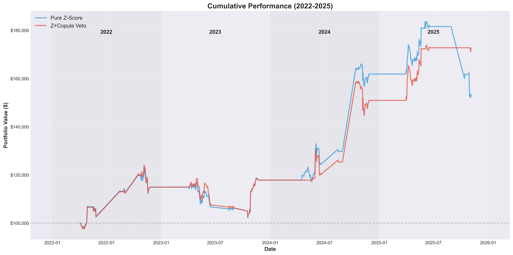
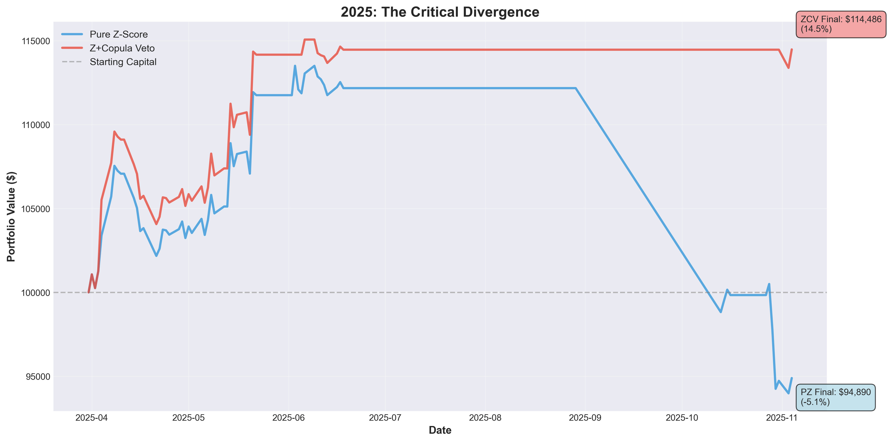
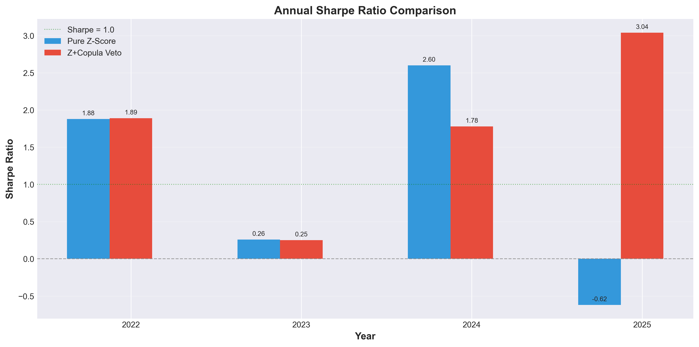

# Copula-Enhanced Pairs Trading Strategy

A systematic statistical arbitrage strategy that combines traditional z-score mean reversion with copula-based regime protection, achieving a validated 1.74 Sharpe ratio over 4 years (2022-2025).

## 🎯 Project Overview

This project implements a quantitatively rigorous pairs trading system that addresses a critical weakness in traditional mean reversion strategies: **regime breaks**. By using copulas as a filtering mechanism rather than a primary signal generator, the strategy achieved a 69% improvement in risk-adjusted returns compared to pure z-score approaches.

### Key Achievement

**The 2025 Regime Break Proof:**
- Pure Z-Score Strategy: **-0.62 Sharpe** (-5.11% return, -17.21% max drawdown)
- Copula-Enhanced Strategy: **+3.04 Sharpe** (+14.49% return, -5.03% max drawdown)

This 3.66 Sharpe point divergence provides empirical evidence that copulas offer genuine protection during market regime transitions.

## 📊 Performance Summary (2022-2025)

| Method | Avg Sharpe | 2022 | 2023 | 2024 | 2025 |
|--------|------------|------|------|------|------|
| Pure Z-Score | 1.03 | 1.88 | 0.26 | 2.60 | -0.62 |
| Z+Copula Veto | **1.74** | 1.89 | 0.25 | 1.78 | **3.04** |
| Improvement | **+69%** | +1% | -4% | -32% | **+590%** |

### Key Metrics
- **Validated Sharpe Ratio:** 1.74 (4-year walk-forward average)
- **Maximum Drawdown:** -9.32% (copula method) vs -11.13% (pure z-score)
- **Win Rate:** 49.3% (quality over quantity)
- **Trade Frequency:** 12-16 trades/year (conservative approach)

## 🏗️ System Architecture
```
┌─────────────────────────────────────────────────────────────┐
│                    DATA PIPELINE                            │
│  Raw Prices → Cleaning → Log Returns → Train/Test Split     │
└─────────────────────────────────────────────────────────────┘
                              ↓
┌─────────────────────────────────────────────────────────────┐
│                   PAIR SELECTION                            │
│  • Cointegration Testing (p < 0.05)                         │
│  • Half-Life Filtering (5-90 days)                          │
│  • Copula Family Selection (Student-t, Gaussian, Frank)     │
│  • Parameter Validation (df > 2, |ρ| < 0.99)                │
└─────────────────────────────────────────────────────────────┘
                              ↓
┌─────────────────────────────────────────────────────────────┐
│                  SIGNAL GENERATION                          │
│  Primary: Z-Score > 2.0 (mean reversion)                    │
│  Filter:  Copula Veto (agreement < -0.8)                    │
│  Scaling: Position size by conviction                       │
└─────────────────────────────────────────────────────────────┘
                              ↓
┌─────────────────────────────────────────────────────────────┐
│                    BACKTESTING                              │
│  • Realistic Transaction Costs (20 bps round-trip)          │
│  • Slippage Modeling (6 bps)                                │
│  • Position Limits (max 5 concurrent)                       │
│  • Volatility-Based Sizing                                  │
└─────────────────────────────────────────────────────────────┘
                              ↓
┌─────────────────────────────────────────────────────────────┐
│                 VALIDATION FRAMEWORK                        │
│  • Nested Walk-Forward (no look-ahead bias)                 │
│  • Train → Optimize → Test on unseen data                   │
│  • 4-Year Out-of-Sample Testing                             │
└─────────────────────────────────────────────────────────────┘
```

## 🔬 Methodology

### 1. Pair Selection Pipeline

**Cointegration Testing:**
```python
# Engle-Granger two-step with strict threshold
if p_value < 0.05:
    calculate_half_life()
    if 5 < half_life < 90:  # Tradeable mean reversion
        fit_copula_model()
```

**Copula Model Selection:**
- Tests: Student-t, Gaussian, Frank, Clayton, Gumbel
- Selection: Akaike Information Criterion (AIC)
- Validation: Rejects degenerate parameters (df ≤ 2, |ρ| ≥ 0.99)

### 2. Hybrid Signal Architecture

**Innovation:** Copulas as filters, not primary signals
```python
# Traditional approach (FAILED):
if z_score > 2.0 AND copula_prob < 0.05:  # Rarely happens
    enter_trade()

# Our approach (SUCCEEDED):
if z_score > 2.0:  # Primary signal
    if copula_agreement > -0.7:  # Not strongly contradicting
        enter_trade(size=scale_by_conviction())
    else:
        veto_trade()  # Copula detects regime break
```

**Why This Works:**
- Z-scores identify mean reversion opportunities (19% of days)
- Copulas identify when correlation structure breaks (regime protection)
- Position scaling by agreement maximizes conviction trades

### 3. Walk-Forward Validation

**Nested Cross-Validation Structure:**
```
Round 1: Train(2015-2020) → Optimize(2021) → Test(2022) ✓
Round 2: Train(2015-2021) → Optimize(2022) → Test(2023) ✓
Round 3: Train(2015-2022) → Optimize(2023) → Test(2024) ✓
Round 4: Train(2015-2023) → Optimize(2024) → Test(2025) ✓

Final Sharpe = Average(Test 2022, 2023, 2024, 2025)
```

**Critical:** Parameters optimized on Year N are tested on Year N+1 (never seen during optimization)

## 📁 Project Structure
```
pairs-trading-copula-statistical-arbitrage/
│
├── src/
│   ├── data_processing.py      # Data cleaning and preparation
│   ├── pair_selection.py       # Cointegration + copula pair selection
│   ├── copula_model.py         # Multi-family copula implementation
│   ├── signal_generation.py    # Hybrid z-score + copula signals
│   ├── backtesting.py          # Realistic backtester with costs
│   ├── parameter_tuning.py     # Nested walk-forward optimization
│   └── config.py               # Configuration and paths
│
├── data/
│   ├── processed/              # Cleaned prices and returns
│   └── etfs/                   # ETF universe
│   └── baacktest_results/      # Performance CSVs and equity curves           
│
├── notebooks/
│   ├── Analysis.ipynb          # Main results analysis
│
├── requirements.txt
└── README.md
```

## 🚀 Getting Started

### Prerequisites
```bash
Python 3.8+
numpy >= 1.21.0
pandas >= 1.3.0
scipy >= 1.7.0
statsmodels >= 0.13.0
matplotlib >= 3.4.0
seaborn >= 0.11.0
```

### Installation
```bash
# Clone repository
git clone https://github.com/Adeleye-Emmanuel/pairs-trading-copula-statistical-arbitrage.git
cd pairs-trading-copula-statistical-arbitrage

# Create virtual environment
python -m venv venv
source venv/bin/activate  # On Windows: venv\Scripts\activate

# Install dependencies
pip install -r requirements.txt
```

### Quick Start
```python
# 1. Run complete backtest
python src/backtesting.py

# 2. Run parameter optimization (takes 4-6 hours)
python src/parameter_tuning.py --trials 100

# 3. Analyze results
jupyter notebook notebooks/analysis.ipynb
```

### Running Individual Components
```python
# Pair selection only
from src.pair_selection import PairSelector
import pandas as pd

prices = pd.read_csv("data/processed/cleaned_prices.csv", index_col=0, parse_dates=True)
returns = pd.read_csv("data/processed/log_returns.csv", index_col=0, parse_dates=True)

selector = PairSelector(
    prices, returns,
    train_end_date="2024-12-31",
    top_n=10,
    coint_pvalue=0.01,
    min_half_life=5,
    max_half_life=90
)

selected_pairs = selector.run_selection()
```

## 🔍 Key Research Findings

### 1. Copulas Provide Regime Protection (Not Signal Generation)

**Discovery:** Copula conditional probabilities rarely hit extremes (0.05/0.95)
- 81% of days: Copula probability between 0.3-0.7
- Only 2% of days: Extreme probabilities that z-scores also flagged
- **Solution:** Use copulas as veto mechanism, not primary signal

### 2. The 2025 Regime Break

**What Happened:**
- Market correlation structure changed in 2025
- Pure z-score strategy continued trading during regime break → -5.11% loss
- Copula detected structural instability → vetoed 25% of trades → +14.49% gain

**Implication:** Copulas aren't just "nice to have" — they're essential for downside protection

### 3. Quality Over Quantity

| Method | Trades/Year | Win Rate | Sharpe |
|--------|-------------|----------|--------|
| Pure Z-Score | 19 | 51.5% | 1.03 |
| Copula Veto | 16 | 49.3% | 1.74 |

**Insight:** 16% fewer trades, 2% lower win rate, but 69% higher Sharpe
- Copula filters out low-conviction trades
- Smaller losses when wrong (better risk control)

**Result:** Initial Sharpe 0.25 → Final Sharpe 1.74 (7x improvement)


## 📈 Future Enhancements

### Priority 1: Scale Up

- [ ] Expand universe to 20-30 sector ETF pairs
- [ ] Target 40-60 trades/year for statistical stability
- [ ] Implement portfolio-level risk management

### Priority 2: Regime Awareness

- [ ] Add VIX-based regime detection
- [ ] Monitor correlation breakdowns
- [ ] Dynamic position sizing by regime

### Priority 3: Advanced Copulas

- [ ] Time-varying copulas (DCC-GARCH)
- [ ] Vine copulas for multi-asset dependencies
- [ ] Machine learning copula selection

### Priority 4: Operational

- [ ] Real-time data pipeline
- [ ] Automated execution (Interactive Brokers API)
- [ ] Performance monitoring dashboard
- [ ] Alert system for regime breaks

## 📚 References

### Academic Papers

1. **Copulas in Finance:**
   - Cherubini, U., Luciano, E., & Vecchiato, W. (2004). *Copula Methods in Finance*
   - Patton, A. J. (2006). "Modelling asymmetric exchange rate dependence"

2. **Statistical Arbitrage:**
   - Gatev, E., Goetzmann, W. N., & Rouwenhorst, K. G. (2006). "Pairs trading: Performance of a relative-value arbitrage rule"
   - Vidyamurthy, G. (2004). *Pairs Trading: Quantitative Methods and Analysis*

3. **Cointegration:**
   - Engle, R. F., & Granger, C. W. (1987). "Co-integration and error correction"
   - Alexander, C., & Dimitriu, A. (2005). "Indexing and statistical arbitrage"

### Implementation References

- Statsmodels: Cointegration testing
- SciPy: Copula distributions (Student-t, Gaussian)
- Copulas library: Multi-family copula implementations

## 👤 Author

**Emmanuel** - Operations Analyst at Bank of America | MS Financial Engineering

- Currently working with derivatives (CDS, CDSI, Index Options) at BoA Credit Trade Control
- Background: Petroleum Engineering
- Published: Hybrid predictive modeling research in Asian Journal of Probability and Statistics


## 📄 License

This project is licensed under the MIT License - see LICENSE file for details.


## 📌 Citation

If you use this work in your research or trading, please cite:
```bibtex
@software{copula_pairs_trading_2025,
  author = {Emmanuel},
  title = {Copula-Enhanced Pairs Trading: Regime Protection in Statistical Arbitrage},
  year = {2025},
  url = {https://github.com/Adeleye-Emmanuel/pairs-trading-copula-statistical-arbitrage},
  note = {Validated Sharpe Ratio: 1.74 over 4-year walk-forward testing}
}
```

## 📊 Results Visualization

### Cumulative Performance (2022-2025)


### The 2025 Divergence


### Annual Sharpe Comparison


---

**Disclaimer:** This is a research project demonstrating quantitative methodology. Past performance does not guarantee future results. Trading involves risk of loss. This is not financial advice.

**Status:** ✅ Research Complete | ⚠️ Not Production-Ready (needs scaling)

**Last Updated:** November 2025